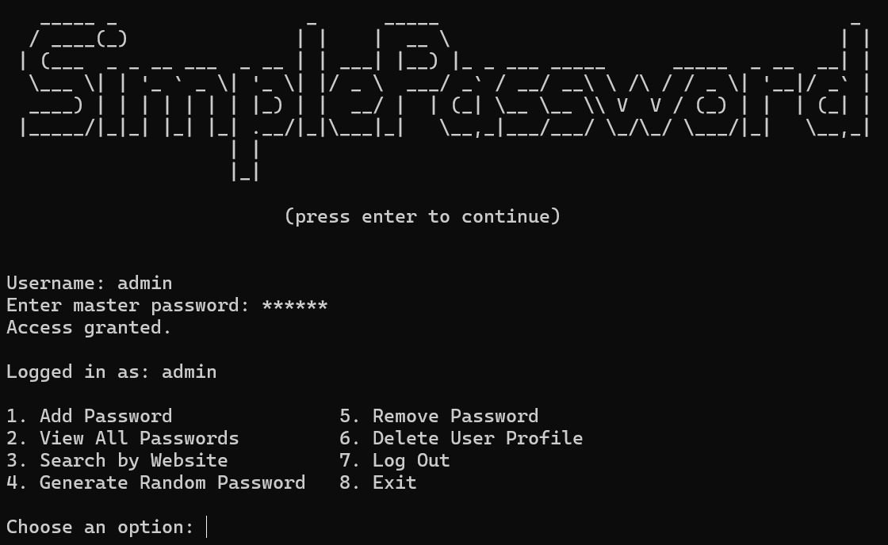

# SimplePassword

##Screenshot

SimplePassword is a command-line password manager built in Python. It allows users to create accounts, securely store login credentials, generate strong passwords, search saved entries, and protect sensitive data using encryption.

\## Features

\- User account creation

\- Master password authentication

\- SHA-256 password hashing

\- Fernet encryption for stored credentials

\- Add, view, search, and remove passwords

\- Random password generation

\- Persistent storage using JSON files

\## Technologies Used

\- Python

\- Cryptography (Fernet)

\- JSON

\- Hashlib

\- Difflib

\- File I/O

\## What I Learned

This project strengthened my understanding of:

\- User authentication and access control

\- Password hashing and encryption

\- Secure credential storage

\- JSON data persistence

\- Python file handling

\- Building command-line applications

\## How To Run

Install dependencies:

pip install cryptography

Run the application:

python simple\_password-1.py

\## Future Improvements

\- Export passwords to encrypted backup files

\- Password expiration reminders

\- GUI version using Tkinter

\- Multi-factor authentication support

